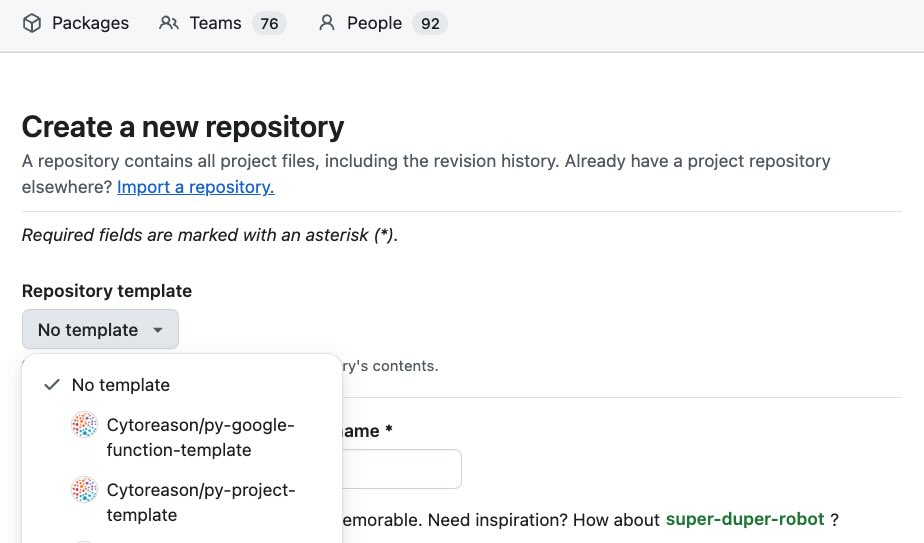

Template Python repo for new projects.

# Setup

1. Create a new repository from this template:
   
   
2. Create a Coder workspace from an appropriate Python workspace template, like for example **cr-u20-slim** and start it

3. Clone your newly created repo into root folder (`/home/coder`)  `git clone https://github.com/CytoReason/<your_repo>.git`

4. In VSCode (recommended) go to File --> Open folder --> Choose <your_repo_folder> and click OK

5. While in repo folder, open terminal and run `./setup.sh`

6. Set the project name and owner 
In `pyproject.toml`:

- Change the project name on line 2 
- Set the version to 0.0.1 on line 3
- Add a description (optional)
- Change the authors on line 5

7. Install dependencies with `poetry install`
The new package name should appear in the output.

## Running tests
~~~ bash
poetry run pytest --cov
~~~

## Adding dependencies
~~~ bash
poetry add numpy
~~~

## Publishing package to artifact registry

### Build package locally and publish to registry
~~~ bash
poetry version patch  # can be major.minor.patch  
poetry build
poetry publish -r cytoreason-ar    #  cytoreason-ar` is referencing the CytoReason's private artifact registry 
~~~

## Building docs with sphinx
~~~ bash
cd docs
$ make html
~~~
